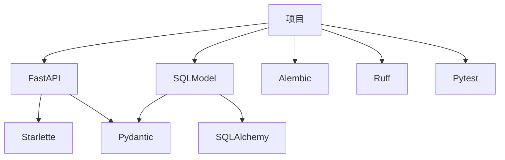

<!-- Pytest Coverage Comment:Begin -->

Coverage Report 
<table><tr><th>File</th><th>Stmts</th><th>Miss</th><th>Cover</th><th>Missing</th></tr><tbody><tr><td colspan="5"><b>app</b></td></tr><tr><td>&nbsp; &nbsp;<a href="https://github.com/MingLi19/data/blob/main/app/main.py">main.py</a></td><td>31</td><td>3</td><td>90%</td><td><a href="https://github.com/MingLi19/data/blob/main/app/main.py#L20">20</a>, <a href="https://github.com/MingLi19/data/blob/main/app/main.py#L57-L58">57&ndash;58</a></td></tr><tr><td colspan="5"><b>app/core</b></td></tr><tr><td>&nbsp; &nbsp;<a href="https://github.com/MingLi19/data/blob/main/app/core/db.py">db.py</a></td><td>10</td><td>3</td><td>70%</td><td><a href="https://github.com/MingLi19/data/blob/main/app/core/db.py#L12">12</a>, <a href="https://github.com/MingLi19/data/blob/main/app/core/db.py#L16-L17">16&ndash;17</a></td></tr><tr><td>&nbsp; &nbsp;<a href="https://github.com/MingLi19/data/blob/main/app/core/error.py">error.py</a></td><td>9</td><td>1</td><td>89%</td><td><a href="https://github.com/MingLi19/data/blob/main/app/core/error.py#L13">13</a></td></tr><tr><td colspan="5"><b>app/entity</b></td></tr><tr><td>&nbsp; &nbsp;<a href="https://github.com/MingLi19/data/blob/main/app/entity/company.py">company.py</a></td><td>16</td><td>2</td><td>88%</td><td><a href="https://github.com/MingLi19/data/blob/main/app/entity/company.py#L7-L8">7&ndash;8</a></td></tr><tr><td>&nbsp; &nbsp;<a href="https://github.com/MingLi19/data/blob/main/app/entity/equipment.py">equipment.py</a></td><td>16</td><td>1</td><td>94%</td><td><a href="https://github.com/MingLi19/data/blob/main/app/entity/equipment.py#L11">11</a></td></tr><tr><td>&nbsp; &nbsp;<a href="https://github.com/MingLi19/data/blob/main/app/entity/meta.py">meta.py</a></td><td>31</td><td>2</td><td>94%</td><td><a href="https://github.com/MingLi19/data/blob/main/app/entity/meta.py#L8-L9">8&ndash;9</a></td></tr><tr><td>&nbsp; &nbsp;<a href="https://github.com/MingLi19/data/blob/main/app/entity/vessel.py">vessel.py</a></td><td>27</td><td>1</td><td>96%</td><td><a href="https://github.com/MingLi19/data/blob/main/app/entity/vessel.py#L10">10</a></td></tr><tr><td colspan="5"><b>app/model</b></td></tr><tr><td>&nbsp; &nbsp;<a href="https://github.com/MingLi19/data/blob/main/app/model/power_speed_curve.py">power_speed_curve.py</a></td><td>18</td><td>18</td><td>0%</td><td><a href="https://github.com/MingLi19/data/blob/main/app/model/power_speed_curve.py#L1-L32">1&ndash;32</a></td></tr><tr><td colspan="5"><b>app/router</b></td></tr><tr><td>&nbsp; &nbsp;<a href="https://github.com/MingLi19/data/blob/main/app/router/equipment.py">equipment.py</a></td><td>33</td><td>33</td><td>0%</td><td><a href="https://github.com/MingLi19/data/blob/main/app/router/equipment.py#L1-L77">1&ndash;77</a></td></tr><tr><td colspan="5"><b>app/service</b></td></tr><tr><td>&nbsp; &nbsp;<a href="https://github.com/MingLi19/data/blob/main/app/service/company.py">company.py</a></td><td>51</td><td>4</td><td>92%</td><td><a href="https://github.com/MingLi19/data/blob/main/app/service/company.py#L45-L48">45&ndash;48</a></td></tr><tr><td>&nbsp; &nbsp;<a href="https://github.com/MingLi19/data/blob/main/app/service/equipment.py">equipment.py</a></td><td>37</td><td>37</td><td>0%</td><td><a href="https://github.com/MingLi19/data/blob/main/app/service/equipment.py#L1-L46">1&ndash;46</a></td></tr><tr><td>&nbsp; &nbsp;<a href="https://github.com/MingLi19/data/blob/main/app/service/upload.py">upload.py</a></td><td>30</td><td>1</td><td>97%</td><td><a href="https://github.com/MingLi19/data/blob/main/app/service/upload.py#L26">26</a></td></tr><tr><td>&nbsp; &nbsp;<a href="https://github.com/MingLi19/data/blob/main/app/service/user.py">user.py</a></td><td>43</td><td>1</td><td>98%</td><td><a href="https://github.com/MingLi19/data/blob/main/app/service/user.py#L35">35</a></td></tr><tr><td><b>TOTAL</b></td><td><b>700</b></td><td><b>107</b></td><td><b>85%</b></td><td>&nbsp;</td></tr></tbody></table>

<!-- Pytest Coverage Comment:End -->

# 项目使用工具

## API: [FastAPI](https://github.com/fastapi/fastapi) 
 

## ORM: [SQLModel](https://github.com/fastapi/sqlmodel) 

## Type: [Pydantic](https://github.com/pydantic/pydantic) 

## Lint: [Ruff](https://github.com/astral-sh/ruff) 

## Test: [Pytest](https://github.com/pytest-dev/pytest) 

## DB Migration: [alembic](https://github.com/sqlalchemy/alembic) 

**All Open Source**

