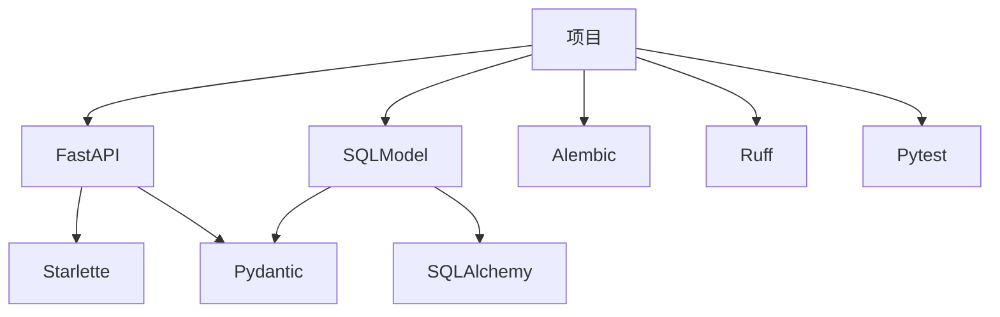

<!-- Pytest Coverage Comment:Begin -->

Coverage Report 
<table><tr><th>File</th><th>Stmts</th><th>Miss</th><th>Cover</th><th>Missing</th></tr><tbody><tr><td colspan="5"><b>app</b></td></tr><tr><td>&nbsp; &nbsp;<a href="https://github.com/MingLi19/data/blob/main/app/main.py">main.py</a></td><td>79</td><td>34</td><td>57%</td><td><a href="https://github.com/MingLi19/data/blob/main/app/main.py#L28-L40">28&ndash;40</a>, <a href="https://github.com/MingLi19/data/blob/main/app/main.py#L43-L51">43&ndash;51</a>, <a href="https://github.com/MingLi19/data/blob/main/app/main.py#L56-L69">56&ndash;69</a>, <a href="https://github.com/MingLi19/data/blob/main/app/main.py#L79-L81">79&ndash;81</a>, <a href="https://github.com/MingLi19/data/blob/main/app/main.py#L103">103</a>, <a href="https://github.com/MingLi19/data/blob/main/app/main.py#L114-L115">114&ndash;115</a>, <a href="https://github.com/MingLi19/data/blob/main/app/main.py#L127-L128">127&ndash;128</a>, <a href="https://github.com/MingLi19/data/blob/main/app/main.py#L140-L141">140&ndash;141</a>, <a href="https://github.com/MingLi19/data/blob/main/app/main.py#L162-L184">162&ndash;184</a></td></tr><tr><td colspan="5"><b>app/core</b></td></tr><tr><td>&nbsp; &nbsp;<a href="https://github.com/MingLi19/data/blob/main/app/core/error.py">error.py</a></td><td>9</td><td>2</td><td>78%</td><td><a href="https://github.com/MingLi19/data/blob/main/app/core/error.py#L8">8</a>, <a href="https://github.com/MingLi19/data/blob/main/app/core/error.py#L13">13</a></td></tr><tr><td>&nbsp; &nbsp;<a href="https://github.com/MingLi19/data/blob/main/app/core/mongo.py">mongo.py</a></td><td>14</td><td>5</td><td>64%</td><td><a href="https://github.com/MingLi19/data/blob/main/app/core/mongo.py#L12">12</a>, <a href="https://github.com/MingLi19/data/blob/main/app/core/mongo.py#L15">15</a>, <a href="https://github.com/MingLi19/data/blob/main/app/core/mongo.py#L18">18</a>, <a href="https://github.com/MingLi19/data/blob/main/app/core/mongo.py#L22-L23">22&ndash;23</a></td></tr><tr><td>&nbsp; &nbsp;<a href="https://github.com/MingLi19/data/blob/main/app/core/mysql.py">mysql.py</a></td><td>17</td><td>6</td><td>65%</td><td><a href="https://github.com/MingLi19/data/blob/main/app/core/mysql.py#L12">12</a>, <a href="https://github.com/MingLi19/data/blob/main/app/core/mysql.py#L17">17</a>, <a href="https://github.com/MingLi19/data/blob/main/app/core/mysql.py#L20">20</a>, <a href="https://github.com/MingLi19/data/blob/main/app/core/mysql.py#L23">23</a>, <a href="https://github.com/MingLi19/data/blob/main/app/core/mysql.py#L27-L28">27&ndash;28</a></td></tr><tr><td>&nbsp; &nbsp;<a href="https://github.com/MingLi19/data/blob/main/app/core/security.py">security.py</a></td><td>64</td><td>38</td><td>41%</td><td><a href="https://github.com/MingLi19/data/blob/main/app/core/security.py#L32">32</a>, <a href="https://github.com/MingLi19/data/blob/main/app/core/security.py#L36">36</a>, <a href="https://github.com/MingLi19/data/blob/main/app/core/security.py#L40-L43">40&ndash;43</a>, <a href="https://github.com/MingLi19/data/blob/main/app/core/security.py#L51-L86">51&ndash;86</a>, <a href="https://github.com/MingLi19/data/blob/main/app/core/security.py#L90-L92">90&ndash;92</a>, <a href="https://github.com/MingLi19/data/blob/main/app/core/security.py#L97-L99">97&ndash;99</a>, <a href="https://github.com/MingLi19/data/blob/main/app/core/security.py#L104-L106">104&ndash;106</a></td></tr><tr><td colspan="5"><b>app/entity</b></td></tr><tr><td>&nbsp; &nbsp;<a href="https://github.com/MingLi19/data/blob/main/app/entity/company.py">company.py</a></td><td>16</td><td>2</td><td>88%</td><td><a href="https://github.com/MingLi19/data/blob/main/app/entity/company.py#L7-L8">7&ndash;8</a></td></tr><tr><td>&nbsp; &nbsp;<a href="https://github.com/MingLi19/data/blob/main/app/entity/equipment.py">equipment.py</a></td><td>16</td><td>1</td><td>94%</td><td><a href="https://github.com/MingLi19/data/blob/main/app/entity/equipment.py#L11">11</a></td></tr><tr><td>&nbsp; &nbsp;<a href="https://github.com/MingLi19/data/blob/main/app/entity/meta.py">meta.py</a></td><td>31</td><td>2</td><td>94%</td><td><a href="https://github.com/MingLi19/data/blob/main/app/entity/meta.py#L8-L9">8&ndash;9</a></td></tr><tr><td>&nbsp; &nbsp;<a href="https://github.com/MingLi19/data/blob/main/app/entity/vessel.py">vessel.py</a></td><td>27</td><td>1</td><td>96%</td><td><a href="https://github.com/MingLi19/data/blob/main/app/entity/vessel.py#L10">10</a></td></tr><tr><td colspan="5"><b>app/router</b></td></tr><tr><td>&nbsp; &nbsp;<a href="https://github.com/MingLi19/data/blob/main/app/router/company.py">company.py</a></td><td>28</td><td>10</td><td>64%</td><td><a href="https://github.com/MingLi19/data/blob/main/app/router/company.py#L23-L24">23&ndash;24</a>, <a href="https://github.com/MingLi19/data/blob/main/app/router/company.py#L35-L36">35&ndash;36</a>, <a href="https://github.com/MingLi19/data/blob/main/app/router/company.py#L43-L44">43&ndash;44</a>, <a href="https://github.com/MingLi19/data/blob/main/app/router/company.py#L51-L52">51&ndash;52</a>, <a href="https://github.com/MingLi19/data/blob/main/app/router/company.py#L59-L60">59&ndash;60</a></td></tr><tr><td>&nbsp; &nbsp;<a href="https://github.com/MingLi19/data/blob/main/app/router/equipment.py">equipment.py</a></td><td>33</td><td>33</td><td>0%</td><td><a href="https://github.com/MingLi19/data/blob/main/app/router/equipment.py#L1-L75">1&ndash;75</a></td></tr><tr><td>&nbsp; &nbsp;<a href="https://github.com/MingLi19/data/blob/main/app/router/power_speed_curve.py">power_speed_curve.py</a></td><td>29</td><td>10</td><td>66%</td><td><a href="https://github.com/MingLi19/data/blob/main/app/router/power_speed_curve.py#L20-L21">20&ndash;21</a>, <a href="https://github.com/MingLi19/data/blob/main/app/router/power_speed_curve.py#L29-L30">29&ndash;30</a>, <a href="https://github.com/MingLi19/data/blob/main/app/router/power_speed_curve.py#L38-L39">38&ndash;39</a>, <a href="https://github.com/MingLi19/data/blob/main/app/router/power_speed_curve.py#L48-L49">48&ndash;49</a>, <a href="https://github.com/MingLi19/data/blob/main/app/router/power_speed_curve.py#L57-L58">57&ndash;58</a></td></tr><tr><td>&nbsp; &nbsp;<a href="https://github.com/MingLi19/data/blob/main/app/router/upload.py">upload.py</a></td><td>45</td><td>9</td><td>80%</td><td><a href="https://github.com/MingLi19/data/blob/main/app/router/upload.py#L72-L75">72&ndash;75</a>, <a href="https://github.com/MingLi19/data/blob/main/app/router/upload.py#L87-L92">87&ndash;92</a></td></tr><tr><td>&nbsp; &nbsp;<a href="https://github.com/MingLi19/data/blob/main/app/router/user.py">user.py</a></td><td>53</td><td>27</td><td>49%</td><td><a href="https://github.com/MingLi19/data/blob/main/app/router/user.py#L25">25</a>, <a href="https://github.com/MingLi19/data/blob/main/app/router/user.py#L31-L32">31&ndash;32</a>, <a href="https://github.com/MingLi19/data/blob/main/app/router/user.py#L38-L39">38&ndash;39</a>, <a href="https://github.com/MingLi19/data/blob/main/app/router/user.py#L47-L48">47&ndash;48</a>, <a href="https://github.com/MingLi19/data/blob/main/app/router/user.py#L56-L57">56&ndash;57</a>, <a href="https://github.com/MingLi19/data/blob/main/app/router/user.py#L63-L64">63&ndash;64</a>, <a href="https://github.com/MingLi19/data/blob/main/app/router/user.py#L70-L77">70&ndash;77</a>, <a href="https://github.com/MingLi19/data/blob/main/app/router/user.py#L85-L103">85&ndash;103</a></td></tr><tr><td colspan="5"><b>app/service</b></td></tr><tr><td>&nbsp; &nbsp;<a href="https://github.com/MingLi19/data/blob/main/app/service/company.py">company.py</a></td><td>51</td><td>34</td><td>33%</td><td><a href="https://github.com/MingLi19/data/blob/main/app/service/company.py#L16">16</a>, <a href="https://github.com/MingLi19/data/blob/main/app/service/company.py#L21">21</a>, <a href="https://github.com/MingLi19/data/blob/main/app/service/company.py#L24-L27">24&ndash;27</a>, <a href="https://github.com/MingLi19/data/blob/main/app/service/company.py#L30-L33">30&ndash;33</a>, <a href="https://github.com/MingLi19/data/blob/main/app/service/company.py#L36-L49">36&ndash;49</a>, <a href="https://github.com/MingLi19/data/blob/main/app/service/company.py#L52-L57">52&ndash;57</a>, <a href="https://github.com/MingLi19/data/blob/main/app/service/company.py#L60-L63">60&ndash;63</a></td></tr><tr><td>&nbsp; &nbsp;<a href="https://github.com/MingLi19/data/blob/main/app/service/data.py">data.py</a></td><td>14</td><td>5</td><td>64%</td><td><a href="https://github.com/MingLi19/data/blob/main/app/service/data.py#L7">7</a>, <a href="https://github.com/MingLi19/data/blob/main/app/service/data.py#L12">12</a>, <a href="https://github.com/MingLi19/data/blob/main/app/service/data.py#L15">15</a>, <a href="https://github.com/MingLi19/data/blob/main/app/service/data.py#L19">19</a>, <a href="https://github.com/MingLi19/data/blob/main/app/service/data.py#L22">22</a></td></tr><tr><td>&nbsp; &nbsp;<a href="https://github.com/MingLi19/data/blob/main/app/service/equipment.py">equipment.py</a></td><td>37</td><td>37</td><td>0%</td><td><a href="https://github.com/MingLi19/data/blob/main/app/service/equipment.py#L1-L47">1&ndash;47</a></td></tr><tr><td>&nbsp; &nbsp;<a href="https://github.com/MingLi19/data/blob/main/app/service/power_speed_curve.py">power_speed_curve.py</a></td><td>37</td><td>24</td><td>35%</td><td><a href="https://github.com/MingLi19/data/blob/main/app/service/power_speed_curve.py#L10">10</a>, <a href="https://github.com/MingLi19/data/blob/main/app/service/power_speed_curve.py#L15">15</a>, <a href="https://github.com/MingLi19/data/blob/main/app/service/power_speed_curve.py#L18-L20">18&ndash;20</a>, <a href="https://github.com/MingLi19/data/blob/main/app/service/power_speed_curve.py#L23-L26">23&ndash;26</a>, <a href="https://github.com/MingLi19/data/blob/main/app/service/power_speed_curve.py#L29-L33">29&ndash;33</a>, <a href="https://github.com/MingLi19/data/blob/main/app/service/power_speed_curve.py#L36-L41">36&ndash;41</a>, <a href="https://github.com/MingLi19/data/blob/main/app/service/power_speed_curve.py#L44-L47">44&ndash;47</a></td></tr><tr><td>&nbsp; &nbsp;<a href="https://github.com/MingLi19/data/blob/main/app/service/upload.py">upload.py</a></td><td>44</td><td>11</td><td>75%</td><td><a href="https://github.com/MingLi19/data/blob/main/app/service/upload.py#L28">28</a>, <a href="https://github.com/MingLi19/data/blob/main/app/service/upload.py#L46-L48">46&ndash;48</a>, <a href="https://github.com/MingLi19/data/blob/main/app/service/upload.py#L52-L68">52&ndash;68</a></td></tr><tr><td>&nbsp; &nbsp;<a href="https://github.com/MingLi19/data/blob/main/app/service/user.py">user.py</a></td><td>47</td><td>31</td><td>34%</td><td><a href="https://github.com/MingLi19/data/blob/main/app/service/user.py#L12">12</a>, <a href="https://github.com/MingLi19/data/blob/main/app/service/user.py#L17">17</a>, <a href="https://github.com/MingLi19/data/blob/main/app/service/user.py#L20-L22">20&ndash;22</a>, <a href="https://github.com/MingLi19/data/blob/main/app/service/user.py#L25-L27">25&ndash;27</a>, <a href="https://github.com/MingLi19/data/blob/main/app/service/user.py#L30-L33">30&ndash;33</a>, <a href="https://github.com/MingLi19/data/blob/main/app/service/user.py#L36-L44">36&ndash;44</a>, <a href="https://github.com/MingLi19/data/blob/main/app/service/user.py#L47-L52">47&ndash;52</a>, <a href="https://github.com/MingLi19/data/blob/main/app/service/user.py#L55-L58">55&ndash;58</a></td></tr><tr><td><b>TOTAL</b></td><td><b>979</b></td><td><b>322</b></td><td><b>67%</b></td><td>&nbsp;</td></tr></tbody></table>

<!-- Pytest Coverage Comment:End -->

# 项目使用工具

## API: [FastAPI](https://github.com/fastapi/fastapi) 
 

## ORM: [SQLModel](https://github.com/fastapi/sqlmodel) 

## Type: [Pydantic](https://github.com/pydantic/pydantic) 

## Lint: [Ruff](https://github.com/astral-sh/ruff) 

## Test: [Pytest](https://github.com/pytest-dev/pytest) 

## DB Migration: [alembic](https://github.com/sqlalchemy/alembic) 

**All Open Source**

