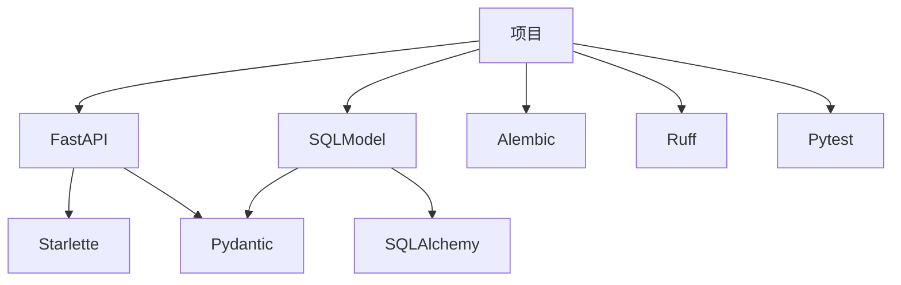

<!-- Pytest Coverage Comment:Begin -->
\n<!-- Pytest Coverage Comment:End -->

# 项目使用工具

## API: [FastAPI](https://github.com/fastapi/fastapi) 
 

## ORM: [SQLModel](https://github.com/fastapi/sqlmodel) 

## Type: [Pydantic](https://github.com/pydantic/pydantic) 

## Lint: [Ruff](https://github.com/astral-sh/ruff) 

## Test: [Pytest](https://github.com/pytest-dev/pytest) 

## DB Migration: [alembic](https://github.com/sqlalchemy/alembic) 

**All Open Source**

