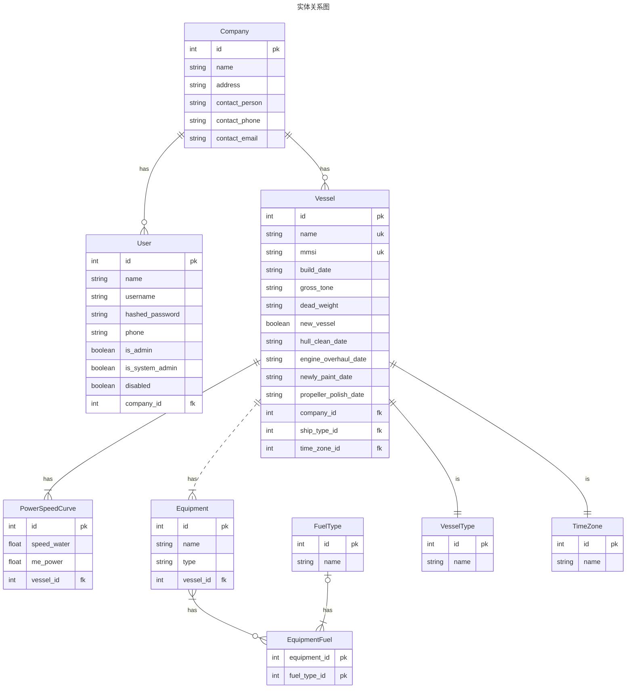

```mermaid
---
title: 实体关系图
---
%%{init: {
  "theme": "default",
  "themeCSS": [
    "[id^=entity-Meta] .er.entityBox { fill: lightgreen;} ",
    "[id^=entity-Master] .er.entityBox { fill: powderblue;} ",
    "[id^=entity-Biz] .er.entityBox { fill: pink;} "
    ]
}}%%
erDiagram
    Master-Company ||--o{ Master-User : has
    Master-Company ||--o{ Master-Vessel : has
    Master-Vessel ||--|{ Master-PowerSpeedCurve : has
    Master-Vessel ||..|{ Master-Equipment : has
    Master-Equipment }|--o{ Master-EquipmentFuel : has
    Meta-FuelType o|--|{ Master-EquipmentFuel : has
    Master-Vessel ||--|| Meta-VesselType : is
    Master-Vessel ||--|| Meta-TimeZone : is
    Master-Company[Company] {
        int id pk
        string name 
        string address
        string contact_person
        string contact_phone
        string contact_email
    }
    Master-User[User] {
        int id pk
        string name
        string username
        string hashed_password
        string phone
        boolean is_admin
        boolean is_system_admin
        boolean disabled
        int company_id fk
    }
    Master-Vessel[Vessel] {
        int id pk
        string name uk
        string mmsi uk
        string build_date
        string gross_tone
        string dead_weight
        boolean new_vessel
        string hull_clean_date
        string engine_overhaul_date
        string newly_paint_date
        string propeller_polish_date
        int company_id fk
        int ship_type_id fk
        int time_zone_id fk
    }
    Master-Equipment[Equipment] {
        int id pk
        string name
        string type
        int vessel_id fk
    }
    Master-EquipmentFuel[EquipmentFuel] {
        int equipment_id pk
        int fuel_type_id pk
    }
    Meta-FuelType[FuelType] {
        int id pk
        string name
    }
    Meta-VesselType[VesselType] {
        int id pk
        string name
    }
    Meta-TimeZone[TimeZone] {
        int id pk
        string name
    }
    Master-PowerSpeedCurve[PowerSpeedCurve] {
        int id pk
        float speed_water
        float me_power
        int vessel_id fk
    }
```

```mermaid
flowchart LR
    
```
