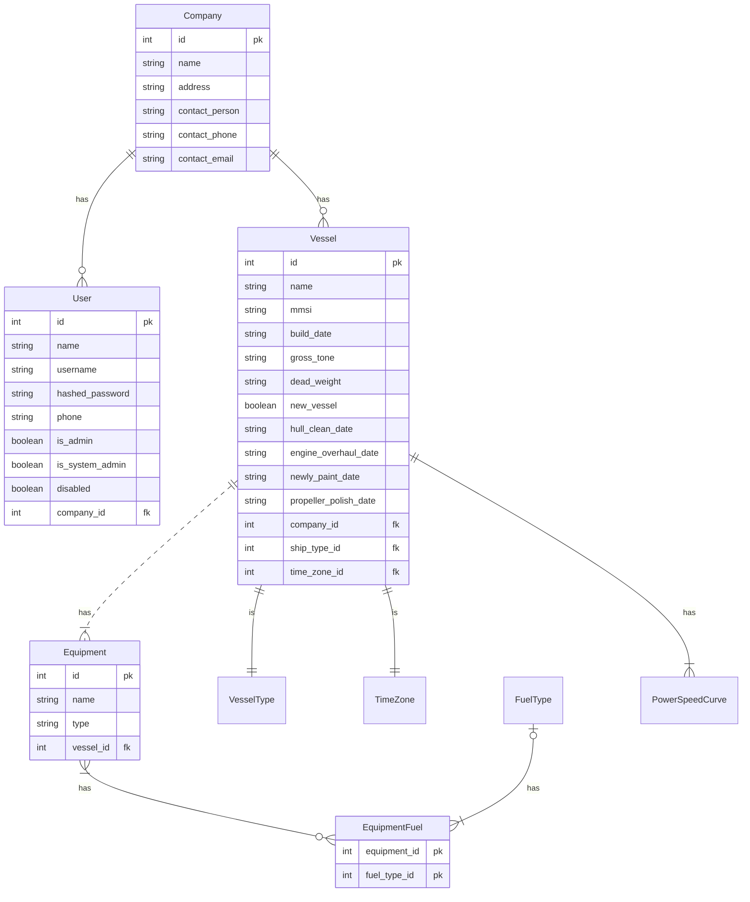

```mermaid
erDiagram
    Company ||--o{ User : has
    Company ||--o{ Vessel : has
    Vessel ||..|{ Equipment : has
    Vessel ||--|| VesselType : is
    Vessel ||--|| TimeZone : is
    Equipment }|--o{ EquipmentFuel : has
    FuelType o|--|{ EquipmentFuel : has
    Vessel ||--|{ PowerSpeedCurve : has
    Company {
        int id pk
        string name 
        string address
        string contact_person
        string contact_phone
        string contact_email
    }
    User {
        int id pk
        string name
        string username
        string hashed_password
        string phone
        boolean is_admin
        boolean is_system_admin
        boolean disabled
        int company_id fk
    }
    Vessel {
        int id pk
        string name
        string mmsi
        string build_date
        string gross_tone
        string dead_weight
        boolean new_vessel
        string hull_clean_date
        string engine_overhaul_date
        string newly_paint_date
        string propeller_polish_date
        int company_id fk
        int ship_type_id fk
        int time_zone_id fk
    }
    Equipment {
        int id pk
        string name
        string type
        int vessel_id fk
    }
    EquipmentFuel {
        int equipment_id pk
        int fuel_type_id pk
    }
    
```
